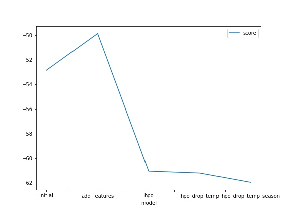
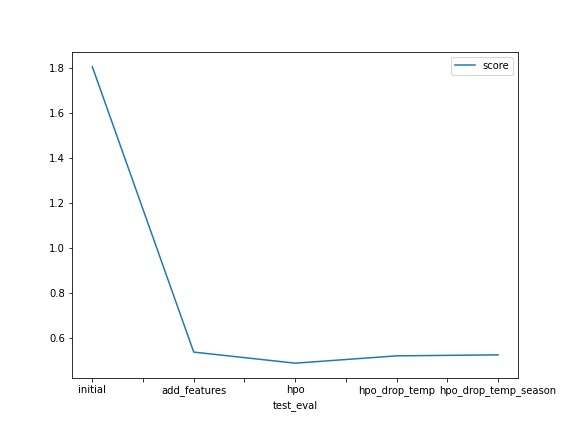
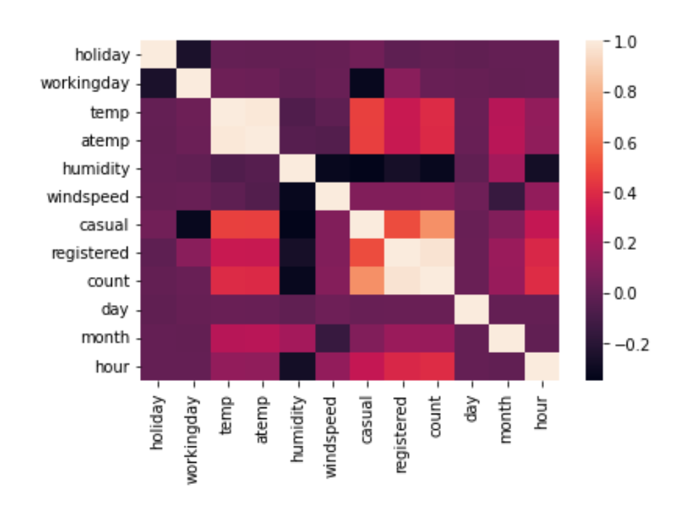
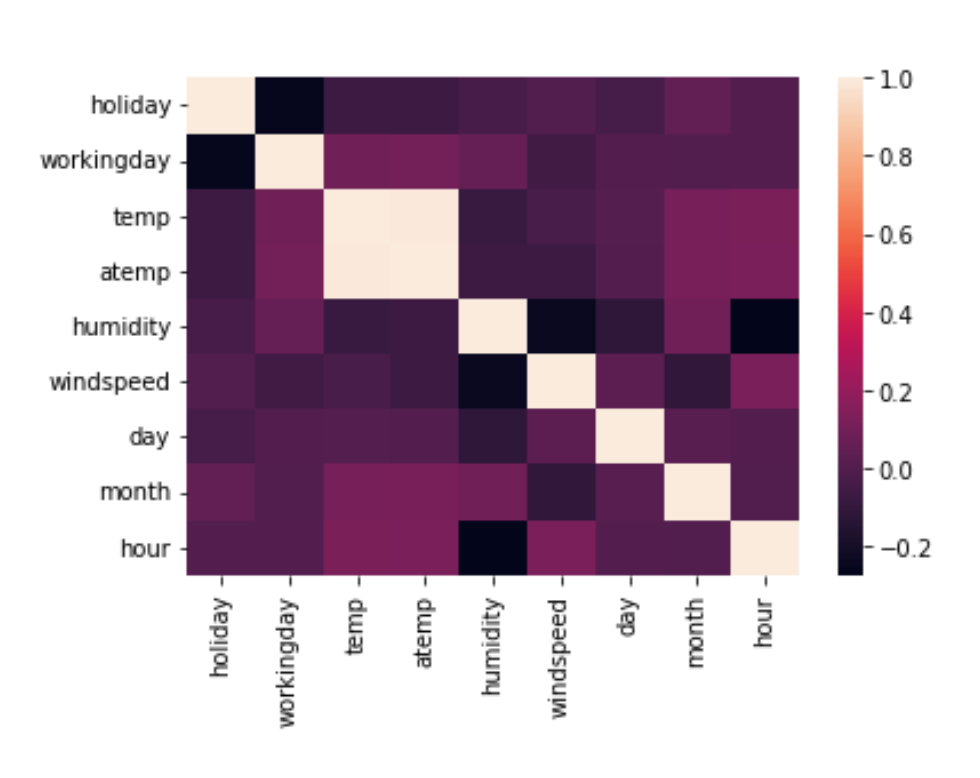

# Report: Predict Bike Sharing Demand with AutoGluon Solution
#### Geethika Hemkumar

## Initial Training
### What did you realize when you tried to submit your predictions? What changes were needed to the output of the predictor to submit your results?
When I initially tried to submit my predictions, I realized that some of them were negative. Negative predictions are invalid in this scenario since the task is to predict the total number of bikes rented during a given hour on a specific date. All negative predictions in the output were set to 0 before submitting the predictions to Kaggle.

### What was the top ranked model that performed?
As shown by the output of calling `fit_summary()` for each of the models, the WeightedEnsemble_L3 model was the top ranked model across all trials (i.e. `initial`, `add_features`, and `hpo` trials). Across all trials, the WeightedEnsemble_L3 model had the lowest root mean squared error (RMSE) and thus was the top ranked model. 

An ensemble model combines the predictions of multiple machine learning models. Based on the naming of this model, the WeightedEnsemble_L3 model likely uses weighted averaging to do this. According to the [AutoGluon documentation](https://auto.gluon.ai/scoredebugweight/api/autogluon.tabular.models.html), the "L3" suffix indicates that the model is trained in stack level 3. This appears to indicate that the WeightedEnsemble model trains three levels of models for prediction.

## Exploratory data analysis and feature creation
### What did the exploratory analysis find and how did you add additional features?
The exploratory data analysis provided insight about the distribution of the training data based on each of its features. I noticed that the "temp" and "atemp" features have a similar distribution. More impotantly, plotting histograms to show the distribution of each feature based on the training data revealed whether the data for each feature had a discrete or continuous distribution. Knowing this can be useful for feature creation. After learning that both the "workingday" and "holiday" features are binary, I determined that these two features can be comibined into a single categorical, nominal feature, where: 

- 0 = day is neither a holiday nor a weekend (holiday = 0 and workingday = 0)
- 1 = day is a working day (holiday = 0 and workingday = 1)
- 2 = day is a holiday (holiday = 1 and workingday = 0)
- 3 = day is a holiday or a weekend (holiday = 1 and workingday = 1)

The creation of this feature would reduce the dimensionality of the dataset (two features are combined into one) instead of introducing additonal data for the model to learn from. A reduction in dimensionality by one feature is likely not as benefical to model accuracy as introducing new features to the dataset. Thus, I created day, month, and hour features from the `datetime` column provided by the train/test data as suggested in the notebook template provided. To do this, I wrote the following code:

`train['day'] = train.datetime.dt.day`

`train['month'] = train.datetime.dt.month`

`train['hour'] = train.datetime.dt.hour`

`test['day'] = test.datetime.dt.day`

`test['month'] = test.datetime.dt.month`

`test['hour'] = test.datetime.dt.hour`

This code accesses the day, month, and hour attributes of the `dt` object contained within the `datetime` variable in both the `train` and `test` data frames. 

### How much better did your model preform after adding additional features and why do you think that is?
After adding the day, month, and hour features, the model score improved by around 2.99 (-52.847896 to -49.857050) and the Kaggle score improved by about 1.27 points (1.80636 to 0.53758). I believe this improvement is due to an improvement in the model's ability to identify patterns in the data and relate the time-based features to the other features and output. For example, it is quite likely that fewer bikes will be rented during the nighttime, when most people are sleeping. Adding an hour feature would allow the model to incorporate such information (if the data corroborates this), and similarly adding the month and day features would allow the model to incorporate other trends that might occur in the data based (either entirely or partially) on the day, hour, or month into the prediction.

## Hyper parameter tuning
### How much better did your model preform after trying different hyper parameters?
After trying different combinations of hyperparameters for the models that Autogluon provides hyperparameter tuning support for (NN_TORCH, GBM, and XGB), I was able to improve the Kaggle score by about 0.05 points (0.53758 to 0.48835). I used the default hyperparameters from the [Autogluon documentation](https://auto.gluon.ai/stable/tutorials/tabular_prediction/tabular-indepth.html) as a baseline for my experimentation. Most notably, I changed the number of epochs for the neural net (10 to 20), the number of hyperparameter tuning trials (5 to 10), and the time limit for training (600s to 900s). I also experimented with the hyperparameter search spaces for the number of leaves in the GBM model and the max tree depth for the XGBoost model. 

Increasing the number of epochs used in training of the neural network would improve prediction accuracy, as this would allow the network to tune its weights for a larger number of iterations. Increasing the number of rounds of hyperparameter tuning would allow the TabularPredictor to test a larger number of combinations of hyperparameters, which would increase the likelihood of higher quality models being produced. Finally, increasing the time limit for training would allow a larger number (and potentially variety) of models to be fit to the training data. This has similar benefits to increasing the number of hyperparameter tuning rounds. 

### If you were given more time with this dataset, where do you think you would spend more time?
If given more time with this dataset, I would conduct further exploratory data analysis in order to determine if more features could be created from the data and conduct more thorough hyperparameter tuning. 

I began further exploratory data analysis by creating correlation heatmaps of all features for both the training and testing data. As shown in the figures below, the `temp` and `atemp` features are nearly perfectly correlated (this makes sense, as `atemp` is the "feels like" temperature and is based on `temp`). Thus, I trained a model without using the `temp` feature (the model named `hpo_drop_temp`) to see if the score would stay nearly the same as the `hpo` model, which includes the `temp` feature. As shown in the table, this was not the case, implying that both the `temp` and `atemp` features provide useful information. Similarly, since the `season` feature is not shown in the correlation heatmaps, I believed that this meant this feature had nearly no correlation with the other features. Thus, I tried training another model (`hpo_drop_temp_season`) without the `temp` and `season` features. As shown in the table, the model score was worse compared to the original `hpo` model, implying that the `season` column is also useful to the model. Further exploratory data analysis could include analyzing these correlation matrices further or creating scatterplots to better identify relationships between features. This would allow me to tune hyperparameters more effectively and determine which model types would suit the data best.

More thorough hyperparameter tuning may include further tuning the hyperparameters for the current models Autogluon supports or adding support for hyperparameter tuning for other models. In addition, I would take more time to understand the significance of various hyperparameters for various models so that I can tune their values more effectively. Another option could be to utilize some of the more advanced hyperparameters of the `fit()` function of the TabularPredictor, such as `num_stack_levels`, `num_bag_folds` and `num_bag_sets`.

### Create a table with the models you ran, the hyperparameters modified, and the kaggle score.
|model|time_limit|num_trials|num_epochs|score|
|--|--|--|--|--|
|initial|600|1|default|1.80636|
|add_features|600|1|default|0.53758|
|hpo|900|10|20|0.48835|
|hpo_drop_temp|900|10|20|0.52092|
|hpo_drop_temp_season|900|10|20|0.52530|

### Create a line plot showing the top model score for the three (or more) training runs during the project.

### Create a line plot showing the top kaggle score for the three (or more) prediction submissions during the project.

### Correlation matrix of all features for the training dataset

### Correlation matrix of all features for the test dataset

## Summary
Overall, this project gave me great insight into the machine learning process: performing exploratory data analysis on the dataset, training a baseline model, performing further feature engineering (in this case, feature engineering), and tuning hyperparameters. This project further reinforced that machine learning is an iterative process and that there is almost always room for further improvement of a model.
